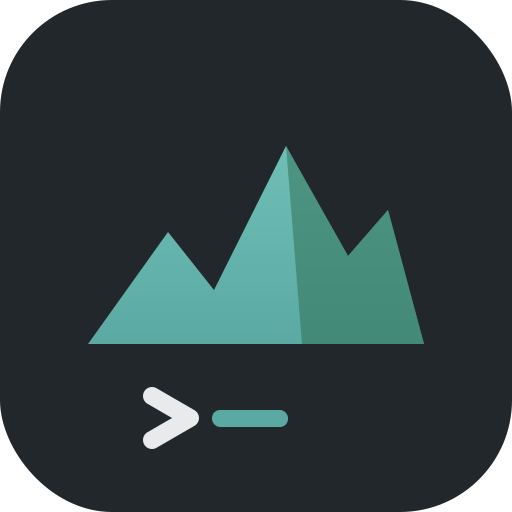
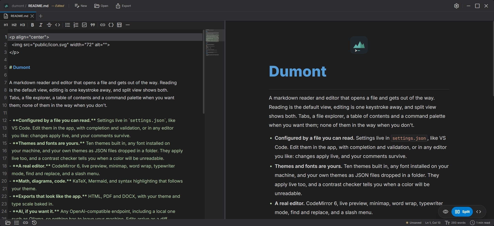

<p align="center">
  
</p>

# Dumont

A markdown reader and editor that opens a file and gets out of the way. Reading
is the default view, editing is one keystroke away, and split view shows both.
Tabs, a file explorer, a table of contents and a command palette when you want
them; none of them in the way when you don't.

<p align="center">
  
</p>

- **Configured by a file you can read.** Settings live in `settings.json`, like
  VS Code. Edit them in the app, with completion and validation, or in any editor
  you like: changes apply live, and your comments survive.
- **Themes and fonts are yours.** Ten themes built in, any font installed on
  your machine, and your own themes as JSON files dropped in a folder. They apply
  live too, and a contrast checker tells you when a color will be unreadable.
- **A real editor.** CodeMirror 6, live preview, minimap, word wrap, typewriter
  mode, find and replace, and a slash menu.
- **Math, diagrams, code.** KaTeX, Mermaid, and syntax highlighting that follows
  your theme.
- **Exports that look like the app.** HTML, PDF and DOCX, with your theme and
  type scale baked in.
- **AI, if you want it.** Any OpenAI-compatible endpoint, including a local one
  such as Ollama, so nothing has to leave your machine. Edits arrive as a diff
  you accept or reject, and the API key is kept in the OS keychain, not in a
  config file.

## Download

The [latest release](https://github.com/toddbartholow/dumont/releases/latest) has
a universal `.dmg` for macOS (Intel and Apple Silicon), `.msi` and `.exe` for
Windows (x64 and ARM64), and `.deb`, `.rpm` and `.AppImage` for Linux.

The builds are not code-signed yet, so the first launch needs a nudge. On macOS 15
(Sequoia) and later, right-clicking no longer works: open the app once and dismiss
the warning, then go to System Settings -> Privacy & Security and click "Open
Anyway" near the bottom. If macOS instead calls the app "damaged", clear the
quarantine flag from a terminal and reopen it:

```bash
xattr -dr com.apple.quarantine /Applications/Dumont.app
```

On Windows, click "More info" then "Run anyway" on the SmartScreen prompt.

## Build

Requires [Bun](https://bun.sh/) and
[Rust](https://www.rust-lang.org/tools/install).

```bash
git clone https://github.com/toddbartholow/dumont.git
cd dumont
bun install
bun run tauri dev      # run it
bun run tauri build    # build it
```

Press `?` in the app for every keyboard shortcut.
[CHANGELOG.md](CHANGELOG.md) has the full record of what's changed.

## Credit

Dumont began as [Paperling](https://github.com/Razee4315/Paperling) by
[Saqlain Abbas](https://github.com/Razee4315).

## License

[Apache 2.0](LICENSE), the same license as the upstream project it derives from.
See [NOTICE](NOTICE) for attribution and the record of modification required by
section 4(b).
