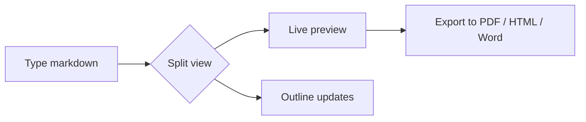
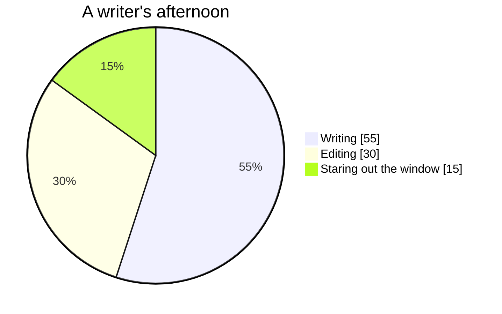

# Welcome to Dumont

This is a **real, editable document**. Nothing here is a screenshot: everything
you see rendered on the right is produced from the markdown on the left. Poke at
it, change things, and watch the preview update live.

> Tip: press **Ctrl+E** to flip between Reader, Split and Code views. In Split
> view you can edit and preview side by side, which is the best way to explore
> this guide.

Open the outline (the list icon in the bottom bar, **Ctrl+Shift+O**) to see every
heading below turn into a clickable table of contents.

---

## 1. The formatting basics

You can write **bold**, *italic*, ***both***, ~~strikethrough~~ and `inline code`
without ever touching the mouse. A few handy shortcuts:

- **Ctrl+B**: bold the selection
- **Ctrl+I**: italic the selection
- **Ctrl+K**: turn the selection into a link

> Block quotes are great for asides, callouts and citations.

1. Ordered lists just work.
2. So do nested ones:
   - like this
   - and this

## 2. Task lists

Track what's done right inside your notes. Try clicking a checkbox in the
preview:

- [x] Install Dumont
- [x] Open this guide
- [ ] Write my first note
- [ ] Export it to PDF

## 3. Tables

| Feature        | Shortcut       | Notes                          |
| -------------- | -------------- | ------------------------------ |
| Command palette| `Ctrl+P`       | Search every action and file   |
| File explorer  | `Ctrl+Shift+E` | Browse the current folder      |
| Outline        | `Ctrl+Shift+O` | Jump between headings          |
| Global search  | `Ctrl+Shift+F` | Find text across your folder   |

## 4. Code with syntax highlighting

Fenced code blocks are highlighted by language, and each one gets a
copy button in the preview.

```js
function greet(name) {
  // Dumont highlights this automatically
  return `Hello, ${name}! Welcome aboard.`;
}

console.log(greet("writer"));
```

## 5. Math and formulas

Dumont renders LaTeX math with KaTeX. Write inline math like $E = mc^2$ or
the quadratic formula between double dollar signs:

$$
x = \frac{-b \pm \sqrt{b^2 - 4ac}}{2a}
$$

It handles sums, integrals and matrices too:

$$
\int_{0}^{\infty} e^{-x^2}\,dx = \frac{\sqrt{\pi}}{2}
\qquad
A = \begin{bmatrix} 1 & 0 \\ 0 & 1 \end{bmatrix}
$$

Chemistry works as well, via the `mhchem` extension:

$$
\ce{CO2 + C -> 2 CO}
$$

## 6. Diagrams with Mermaid

Turn a fenced `mermaid` block into a diagram. Here's a flowchart of how a note
travels through Dumont:



And a quick breakdown of where writers spend their time:



## 7. Footnotes and links

You can cite sources with footnotes[^1] and link out to anything, like the
[Markdown Guide](https://www.markdownguide.org).

Internal links between your own notes use wiki-style syntax. Typing
`[[Another Note]]` links straight to a file in the same folder, and Dumont
autocompletes the names as you type `[[`.

[^1]: Footnotes render down here, and the reference above links to them.

---

## Where to next?

- Press **Ctrl+P** and start typing to reach any command instantly.
- Drop an image into the editor and Dumont saves it alongside your note.
- Pick a theme (Dark, Light, Paper, Dracula, VS 2017 Dark) from the gear menu.

That's the whole toolkit. Delete everything on this page and start writing your
own note whenever you're ready. Happy writing.
